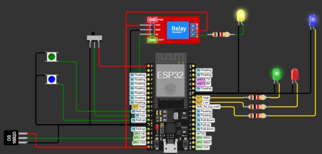

# Sistema de Controle Térmico Ativo para Servidores (IoT)

Projeto Final da disciplina de **Controle de Processos por Computador** - UERJ.

## 📝 Descrição
Este projeto consiste em um sistema de controle de temperatura em malha fechada para servidores de alta performance. Utiliza um **ESP32** para realizar o controle PID local de uma ventoinha e um servidor **Django** na nuvem para supervisão remota e registro histórico.

## 🚀 Funcionalidades
- **Controle PID Local:** Mantém a temperatura estável no Setpoint.
- **Física Simulada:** O firmware simula a inércia térmica para testes realistas.
- **Segurança (Fail-Safe):** Corte de energia automático em caso de superaquecimento, porta aberta ou vibração.
- **IoT / Nuvem:** Dashboard web para monitoramento em tempo real e alteração de Setpoint.
- **Controle de Pânico:** Botão virtual para corte de emergência remoto.

## 🛠️ Tecnologias Utilizadas
- **Hardware Simulado:** Wokwi (ESP32, DS18B20, Relé, LEDs).
- **Firmware:** C++ (Arduino Core).
- **Backend:** Python / Django.
- **Frontend:** HTML5, Bootstrap, Chart.js.
- **Comunicação:** HTTP REST API (JSON).

## 📸 Screenshots
### Circuito no Wokwi

### Dashboard de Supervisão
.drawio.png)

## ⚙️ Como Rodar a Simulação
1. Acesse o projeto no Wokwi: `https://wokwi.com/projects/448807308377028609`
2. O Backend está rodando em: `http://philipy.pythonanywhere.com`
3. Inicie a simulação e observe os gráficos no site.

## 👨‍💻 Autor

**Philipy Macêdo Borges Ramos** Engenharia - UERJ
